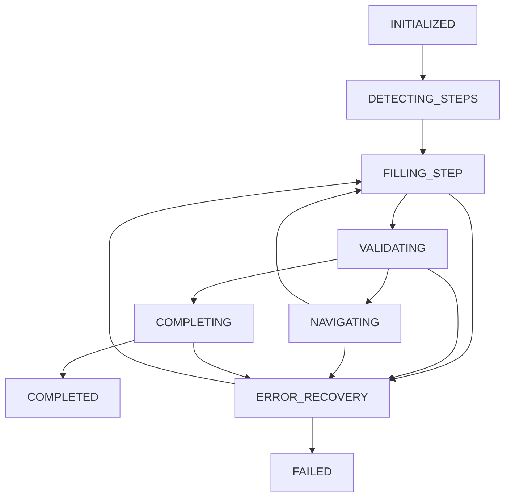

# Application State Machine Documentation

## Overview

The Application State Machine is a robust system for handling multi-step job applications with intelligent step detection, dynamic form handling, progress tracking, and comprehensive error recovery. It's specifically designed for complex application flows like LinkedIn Easy Apply, Indeed multi-step forms, and other job platforms.

## Architecture

### Core Components

#### 🔄 **ApplicationStateMachine**
Main orchestrator that manages the entire application flow using clean state management patterns.

#### 🔍 **StepDetector** 
Intelligent step detection and analysis for different job platforms.

#### 🧭 **StepNavigator**
Handles navigation between application steps and form submission.

#### 📊 **ProgressTracker**
Tracks application progress and provides detailed metrics.

## State Machine Design

### State Definitions



### State Descriptions

| State | Purpose | Next States |
|-------|---------|-------------|
| `INITIALIZED` | Starting point, setup | `DETECTING_STEPS` |
| `DETECTING_STEPS` | Analyze application flow | `FILLING_STEP`, `FAILED` |
| `FILLING_STEP` | Fill current step form | `VALIDATING`, `ERROR_RECOVERY` |
| `VALIDATING` | Validate current step | `NAVIGATING`, `COMPLETING`, `ERROR_RECOVERY` |
| `NAVIGATING` | Move to next step | `FILLING_STEP`, `ERROR_RECOVERY` |
| `COMPLETING` | Final submission | `COMPLETED`, `ERROR_RECOVERY` |
| `ERROR_RECOVERY` | Handle errors and retry | `FILLING_STEP`, `FAILED` |
| `COMPLETED` | Success terminal state | - |
| `FAILED` | Failure terminal state | - |

## Usage Examples

### Basic LinkedIn Easy Apply

```javascript
import { ApplicationStateMachine } from './applicationStateMachine.js';

const stateMachine = new ApplicationStateMachine({
  maxRetries: 3,
  enableStealth: true,
  debugMode: true
});

const userData = {
  firstName: 'John',
  lastName: 'Doe',
  email: 'john.doe@example.com',
  phone: '+1-555-0123',
  coverLetter: 'I am excited to apply...',
  customAnswers: {
    'sponsorship': 'No',
    'remote': 'Yes'
  }
};

const result = await stateMachine.startApplication(userData, {
  platform: 'linkedin',
  autoSubmit: false
});

if (result.success) {
  console.log(`✅ Application completed in ${result.duration}ms`);
} else {
  console.log(`❌ Application failed: ${result.errors}`);
}
```

### Multi-Platform Support

```javascript
// LinkedIn Easy Apply
const linkedinConfig = {
  platform: 'linkedin',
  jobId: 'job-123456',
  autoSubmit: false
};

// Indeed Application
const indeedConfig = {
  platform: 'indeed',
  validateEachStep: true
};

// Generic Multi-Step Form
const genericConfig = {
  platform: 'generic',
  customFieldMapping: {
    'full_name': `${userData.firstName} ${userData.lastName}`
  }
};
```

## Configuration Options

### ApplicationStateMachine Options

| Option | Type | Default | Description |
|--------|------|---------|-------------|
| `maxRetries` | number | `3` | Maximum retry attempts per error |
| `stepTimeout` | number | `30000` | Timeout for step operations (ms) |
| `enableStealth` | boolean | `true` | Enable human-like behavior |
| `autoAdvance` | boolean | `true` | Automatically advance through steps |
| `debugMode` | boolean | `false` | Enable detailed logging |

### Application Configuration

```javascript
const applicationConfig = {
  platform: 'linkedin',           // Target platform
  jobId: 'job-123456',            // Job identifier
  autoSubmit: false,              // Auto-submit or manual review
  skipOptionalFields: true,       // Skip non-required fields
  validateEachStep: true,         // Validate before advancing
  customFieldMapping: {          // Platform-specific mappings
    'applicant.name': 'John Doe'
  }
};
```

## Step Detection

### Platform Support

#### LinkedIn Easy Apply
```javascript
// Detected elements
{
  modal: '.jobs-easy-apply-modal',
  steps: '.jobs-easy-apply-form-section',
  currentStep: '[data-easy-apply-form-element]',
  buttons: {
    continue: '[data-control-name="continue_unify"]',
    submit: '[data-control-name="submit_unify"]',
    review: '[data-control-name="review_unify"]'
  }
}
```

#### Indeed Applications
```javascript
// Detected elements
{
  container: '.ia-ApplyForm',
  steps: '.ia-ApplyForm-section',
  currentStep: '.ia-ApplyForm-section:not([style*="display: none"])',
  buttons: {
    continue: '.ia-continueButton',
    submit: '.ia-submitButton'
  }
}
```

#### Generic Forms
```javascript
// Fallback detection
{
  container: 'form[class*="apply"], form[id*="apply"]',
  steps: '.step, .form-step, [class*="step"]',
  buttons: {
    continue: 'button:contains("Next"), button:contains("Continue")',
    submit: 'button[type="submit"], input[type="submit"]'
  }
}
```

### Step Detection Process

1. **Platform Detection** - Identify current job site
2. **Container Detection** - Find application form container
3. **Step Analysis** - Count and analyze form steps
4. **Current Step Index** - Determine active step
5. **Button Analysis** - Identify navigation buttons

## Error Recovery

### Recovery Strategies

| Error Type | Recovery Options |
|------------|------------------|
| `NETWORK_ERROR` | `wait_and_retry`, `reload_page` |
| `DOM_ERROR` | `wait_for_element`, `refresh_detection` |
| `VALIDATION_ERROR` | `correct_data`, `skip_validation` |
| `NAVIGATION_ERROR` | `find_alternate_button`, `manual_navigation` |
| `FORM_ERROR` | `retry_fill`, `use_direct_fill` |

### Error Recovery Flow

```javascript
// Error classification
const errorType = classifyError(error.message);

// Get recovery options
const recoveryOptions = getRecoveryOptions(errorType);

// Apply first available strategy
const strategy = recoveryOptions[0];
const recoveryResult = await applyRecoveryStrategy(strategy);

if (recoveryResult.success) {
  // Resume from appropriate state
  await transition(recoveryResult.resumeState || 'FILLING_STEP');
} else {
  // Increment retry count or fail
  throw new Error(`Recovery failed: ${recoveryResult.error}`);
}
```

## Progress Tracking

### Progress Metrics

```javascript
const progress = stateMachine.progressTracker.getProgress();

console.log('Progress:', {
  percentage: progress.percentage,      // 0-100%
  phase: progress.phase,               // Current phase
  step: progress.step,                 // Current step index
  totalSteps: progress.totalSteps,     // Total steps detected
  completed: progress.completed,       // Final success
  failed: progress.failed,            // Final failure
  phases: progress.phases             // Phase history
});
```

### Phase Timeline

```javascript
// Track phase transitions
progress.phases.forEach((phase, index) => {
  console.log(`Phase ${index + 1}: ${phase.phase} at ${phase.timestamp}`);
});
```

## Advanced Features

### Dynamic Form Handling

```javascript
// Context-aware form handling
const stepContext = await stepDetector.getCurrentStepContext();

const fillResult = await autoFill.autoFill(userData, {
  scope: stepContext.scope,           // Limit to current step
  skipFilledFields: true,            // Skip pre-filled fields
  validateFields: true               // Validate before proceeding
});
```

### Custom Field Mapping

```javascript
// Platform-specific customizations
const applicationConfig = {
  customFieldMapping: {
    'applicant.fullName': `${userData.firstName} ${userData.lastName}`,
    'applicant.emailAddress': userData.email,
    'applicant.phoneNumber': userData.phone
  },
  customAnswers: {
    'Do you require sponsorship?': 'No',
    'Are you willing to relocate?': 'Yes',
    'Expected salary range?': userData.expectedSalary
  }
};
```

### Validation Rules

```javascript
// Step validation
const validation = await stepDetector.validateCurrentStep();

if (!validation.valid) {
  // Handle validation errors
  await transition('ERROR_RECOVERY', {
    validationError: validation.error
  });
}
```

## Performance Optimization

### Efficient Step Detection

```javascript
// Cached platform detection
this.currentPlatform = this.detectPlatform();

// Optimized element queries
const steps = document.querySelectorAll(selectors.steps);
const currentStepIndex = this.getCurrentStepIndex();
```

### Memory Management

```javascript
// Context cleanup
this.context = {
  userData,
  applicationConfig,
  stepData: new Map(),  // Efficient step storage
  errors: []            // Error collection
};

// Observer cleanup
observer.disconnect();
```

### Retry Optimization

```javascript
// Exponential backoff for retries
const retryDelay = Math.min(1000 * Math.pow(2, retryCount), 30000);
await new Promise(resolve => setTimeout(resolve, retryDelay));
```

## Testing and Debugging

### Debug Mode

```javascript
const stateMachine = new ApplicationStateMachine({
  debugMode: true  // Enable detailed logging
});

// Logs show:
// - State transitions
// - Step detection results  
// - Form filling progress
// - Error recovery attempts
```

### Testing Utilities

```javascript
import { stateMachineTestingExample } from './applicationStateMachineExamples.js';

// Run comprehensive tests
const testResults = await stateMachineTestingExample();

console.log(`Tests: ${testResults.filter(r => r.passed).length}/${testResults.length} passed`);
```

## Integration Examples

### Auto-Fill Integration

```javascript
// Seamless integration with AutoFillSystem
this.autoFill = new AutoFillSystem({
  enableStealth: this.config.enableStealth,
  validateFields: true
});

// Step-scoped filling
const fillResult = await this.autoFill.autoFill(userData, {
  scope: stepContext.scope
});
```

### Stealth Integration

```javascript
// Human-like behavior during navigation
await StealthUtils.actionDelay();
button.scrollIntoView({ behavior: 'smooth' });
await new Promise(resolve => setTimeout(resolve, 500));
button.click();
```

## Error Handling Best Practices

### Graceful Degradation

```javascript
try {
  const result = await stateMachine.startApplication(userData);
  return result;
} catch (error) {
  // Log error details
  console.error('Application failed:', {
    error: error.message,
    state: stateMachine.currentState,
    step: stateMachine.currentStep,
    context: stateMachine.context
  });
  
  // Return partial result
  return stateMachine.getResult();
}
```

### Recovery Logging

```javascript
// Detailed error context
this.context.errors.push({
  error: error.message,
  state: this.currentState,
  step: this.currentStep,
  timestamp: Date.now(),
  recoveryAttempts: this.retryCount
});
```

## Security Considerations

### Input Validation

```javascript
// Validate user data before processing
const validatedUserData = validateUserData(userData);

// Sanitize field values
const sanitizedValue = sanitizeInput(fieldValue);
```

### Rate Limiting

```javascript
// Built-in delays between steps
await StealthUtils.actionDelay();

// Respect platform rate limits
if (platform === 'linkedin') {
  await new Promise(resolve => setTimeout(resolve, 2000));
}
```

## Browser Compatibility

### Supported Features
- ✅ ES2020+ async/await
- ✅ Map and Set collections
- ✅ MutationObserver API
- ✅ Promise.race() for timeouts
- ✅ Custom Error classes

### Platform Support
- ✅ Chrome 88+
- ✅ Firefox 85+
- ✅ Safari 14+
- ✅ Edge 88+

## API Reference

### ApplicationStateMachine

```typescript
class ApplicationStateMachine {
  constructor(options?: StateMachineOptions)
  
  async startApplication(
    userData: UserData, 
    config?: ApplicationConfig
  ): Promise<ApplicationResult>
  
  async transition(newState: string, data?: any): Promise<void>
  async executeCurrentState(): Promise<void>
  async handleError(error: Error): Promise<void>
  
  isTerminalState(): boolean
  getResult(): ApplicationResult
}
```

### StepDetector

```typescript
class StepDetector {
  async detectSteps(): Promise<StepInfo>
  async getCurrentStepContext(): Promise<StepContext>
  async validateCurrentStep(): Promise<ValidationResult>
  async waitForStepLoad(stepIndex: number): Promise<void>
  async refreshDetection(): Promise<StepInfo>
}
```

### StepNavigator

```typescript
class StepNavigator {
  async navigateToNext(): Promise<NavigationResult>
  async submitApplication(): Promise<SubmissionResult>
  async clickButton(button: HTMLElement): Promise<void>
}
```

### ProgressTracker

```typescript
class ProgressTracker {
  updateProgress(update: ProgressUpdate): void
  getProgress(): Progress
  calculatePercentage(): number
  markComplete(): void
  markFailed(error: Error): void
}
```

This state machine provides a robust, scalable solution for handling complex multi-step job applications with intelligent error recovery and comprehensive progress tracking.
